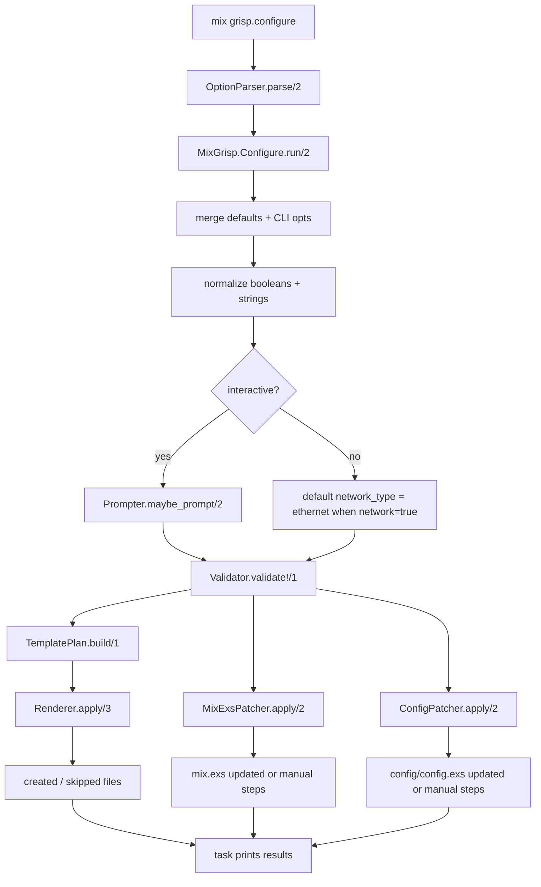
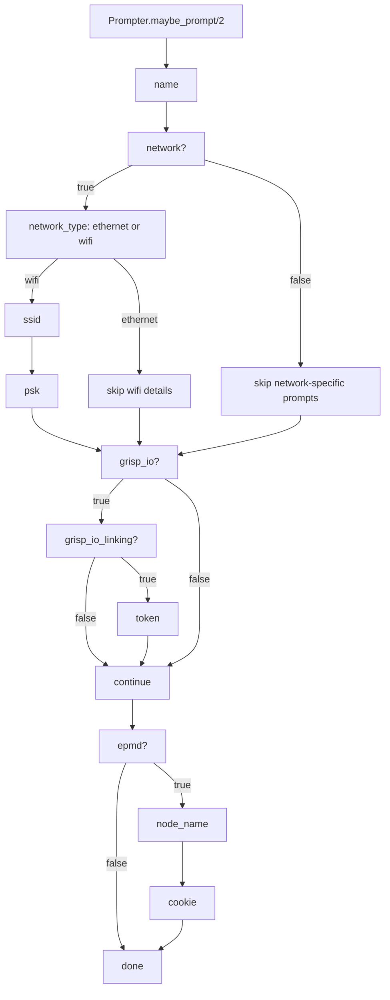
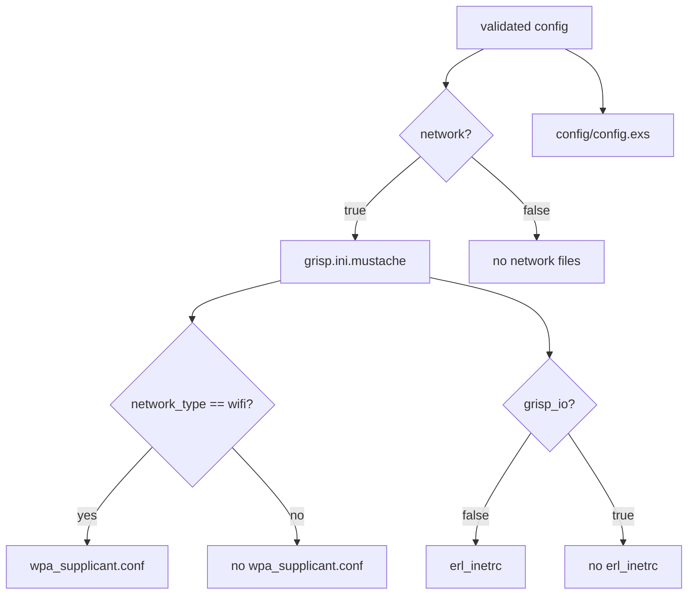
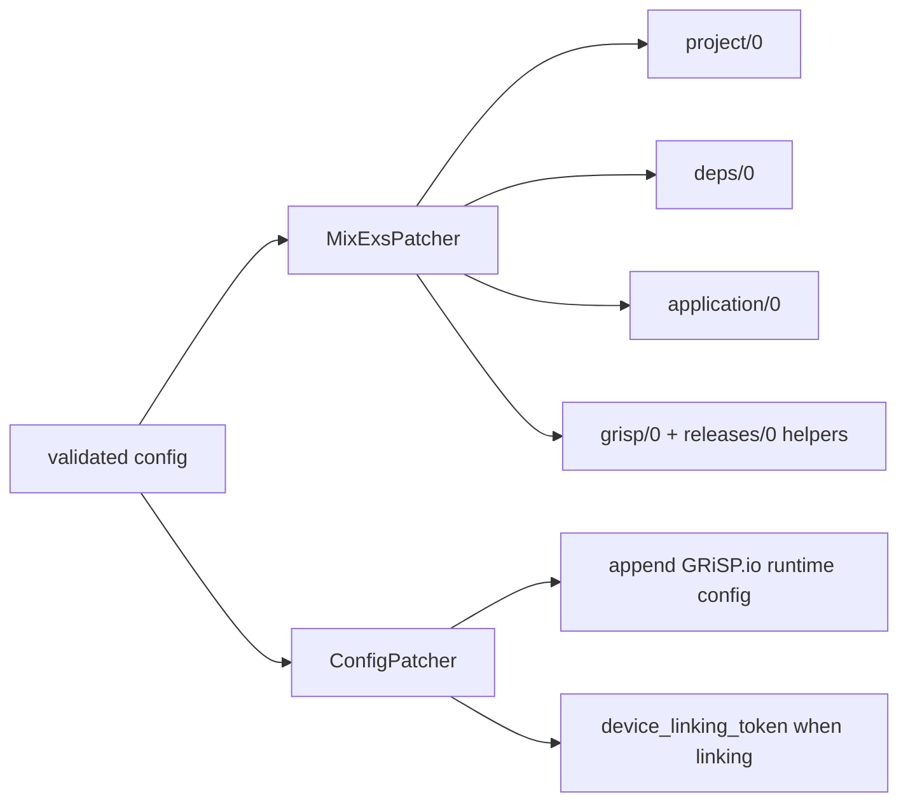

# Current CLI Flow

This document describes the current `mix grisp.configure` flow as implemented in
`mix_grisp`.

## Main Flow

## Interactive Branch

## Generated Files

## Patchers

## Module Map

- [`lib/mix/tasks/grisp/configure.ex`](../lib/mix/tasks/grisp/configure.ex)
  CLI entrypoint and result printing
- [`lib/mix_grisp/configure.ex`](../lib/mix_grisp/configure.ex)
  orchestration
- [`lib/mix_grisp/configure/prompter.ex`](../lib/mix_grisp/configure/prompter.ex)
  interactive prompts
- [`lib/mix_grisp/configure/validator.ex`](../lib/mix_grisp/configure/validator.ex)
  config validation
- [`lib/mix_grisp/configure/template_plan.ex`](../lib/mix_grisp/configure/template_plan.ex)
  file selection
- [`lib/mix_grisp/configure/renderer.ex`](../lib/mix_grisp/configure/renderer.ex)
  file rendering/copying
- [`lib/mix_grisp/configure/mix_exs_patcher.ex`](../lib/mix_grisp/configure/mix_exs_patcher.ex)
  conservative `mix.exs` patching
- [`lib/mix_grisp/configure/config_patcher.ex`](../lib/mix_grisp/configure/config_patcher.ex)
  conservative `config/config.exs` patching
- [`lib/mix_grisp/configure/snippets.ex`](../lib/mix_grisp/configure/snippets.ex)
  shared snippets and manual-step text
